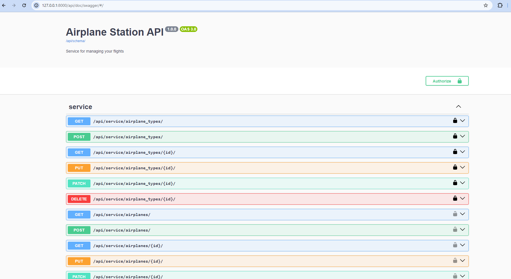
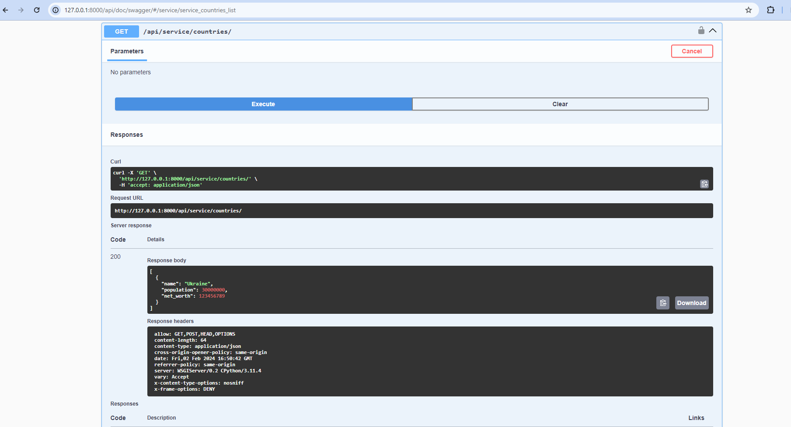

# Airline Management System

An airline management system built using Django REST Framework, Docker, and PostgreSQL.

## Table of Contents

- [Introduction](#introduction)
- [Features](#features)
- [Prerequisites](#prerequisites)
- [Getting Started](#getting-started)
  - [Docker Setup](#docker-setup)
  - [Environment Variables](#environment-variables)
- [API Documentation](#api-documentation)
- [Models](#models)
- [Contributing](#contributing)
- [License](#license)

## Introduction

The Airline Management System is a Django-based application designed to manage various aspects of an airline, including crew members, countries, airports, airplanes, routes, orders, and flights.

## Features

### Django REST Framework Viewsets

#### 1. CrewViewSet

- **Endpoint:** `/api/crew/`
- **Actions:**
  - `list`: List all crews.
  - `retrieve`: Retrieve a specific crew.
- **Additional Actions:**
  - `list`: Returns a detailed list of crews including related flights, routes, and airplane types.

#### 2. CountryViewSet

- **Endpoint:** `/api/country/`
- **Actions:**
  - `list`: List all countries.
  - `retrieve`: Retrieve a specific country.

#### 3. UserViewSet

- **Endpoint:** `/api/user/`
- **Actions:**
  - `list`: List all users.
  - `retrieve`: Retrieve a specific user.

#### 4. AirportViewSet

- **Endpoint:** `/api/airport/`
- **Actions:**
  - `list`: List all airports.
  - `retrieve`: Retrieve a specific airport.
- **Additional Actions:**
  - `list`: Returns a list of airports with details about the associated country for each airport.

#### 5. AirplaneTypeViewSet

- **Endpoint:** `/api/airplane-type/`
- **Actions:**
  - `list`: List all airplane types.
  - `retrieve`: Retrieve a specific airplane type.

#### 6. AirplaneViewSet

- **Endpoint:** `/api/airplane/`
- **Actions:**
  - `list`: List all airplanes.
  - `retrieve`: Retrieve a specific airplane.
  - `upload_image`: Upload an image for a specific airplane (Admin only).
- **Additional Actions:**
  - `upload_image`: Allows administrators to upload an image for a specific airplane.

#### 7. RouteViewSet

- **Endpoint:** `/api/route/`
- **Actions:**
  - `list`: List all routes.
  - `retrieve`: Retrieve a specific route.
- **Additional Features:**
  - **Filtering:** Supports filtering routes by source and destination cities.

#### 8. OrderViewSet

- **Endpoint:** `/api/order/`
- **Actions:**
  - `list`: List all orders for the authenticated user.
  - `retrieve`: Retrieve a specific order for the authenticated user.
  - `create`: Create a new order for the authenticated user.
- **Additional Features:**
  - **Pagination:** Orders are paginated with a page size of 5.

#### 9. FlightViewSet

- **Endpoint:** `/api/flight/`
- **Actions:**
  - `list`: List all flights with details about available seats.
  - `retrieve`: Retrieve a specific flight.
- **Additional Features:**
  - **Seats Availability:** Provides information about available seats for each flight.

## Prerequisites

Ensure you have the following installed on your system:

- [Docker](https://docs.docker.com/get-docker/)
- [Docker Compose](https://docs.docker.com/compose/install/)
- [Git](https://git-scm.com/)

## Getting Started

### Docker Setup

1. **Clone the repository:**

   ```bash
   git clone https://github.com/Shum430/Airport_API_Service/tree/develop
   python -m  venv venv
   venv/Scripts/activate
  **Set environmental variables. Create .env file and fill the varibles with your data like inside  .env.sample**
  ```bash
   docker-compose build
   docker-compose up
   ```


# Airline Management System

An airline management system built using Django REST Framework, Docker, and PostgreSQL.

## Environment Variables

Ensure the following environment variables are set in your `.env` file:

```env
# Django settings
DJANGO_SECRET_KEY=your_secret_key
DJANGO_DEBUG=True
DJANGO_ALLOWED_HOSTS=your_domain_or_ip

# PostgreSQL settings
DB_HOST=db
DB_NAME=ams_database
DB_USER=ams_user
DB_PASSWORD=ams_password
Replace placeholders with your actual settings.

API Documentation
Explore the API endpoints and their functionalities by referring to the generated API documentation.

Django Admin: http://localhost:8000/admin/
Debug Toolbar: http://localhost:8000/__debug__/
API Service: http://localhost:8000/api/service/
API User: http://localhost:8000/api/user/
API Schema: http://localhost:8000/api/schema/
Swagger UI: http://localhost:8000/api/doc/swagger/
ReDoc: http://localhost:8000/api/doc/redoc/

Models
The project includes the following Django models:

Crew
Country
User
Airport
AirplaneType
Airplane
Route
Order
Flight
For detailed information about each model, refer to the corresponding serializers and viewsets in the airport app.

Feel free to customize this according to your project's specific details and requirements.
```

